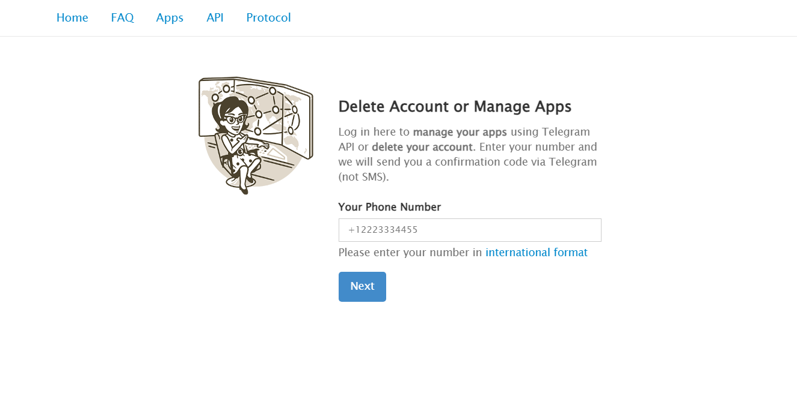
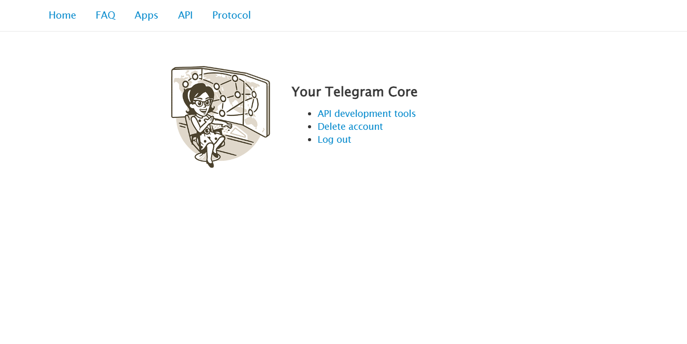
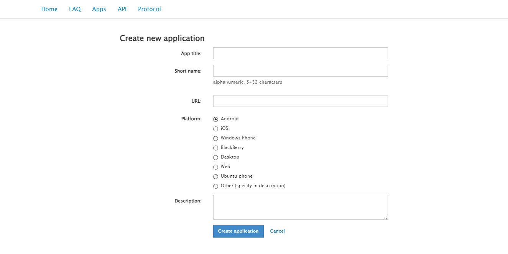
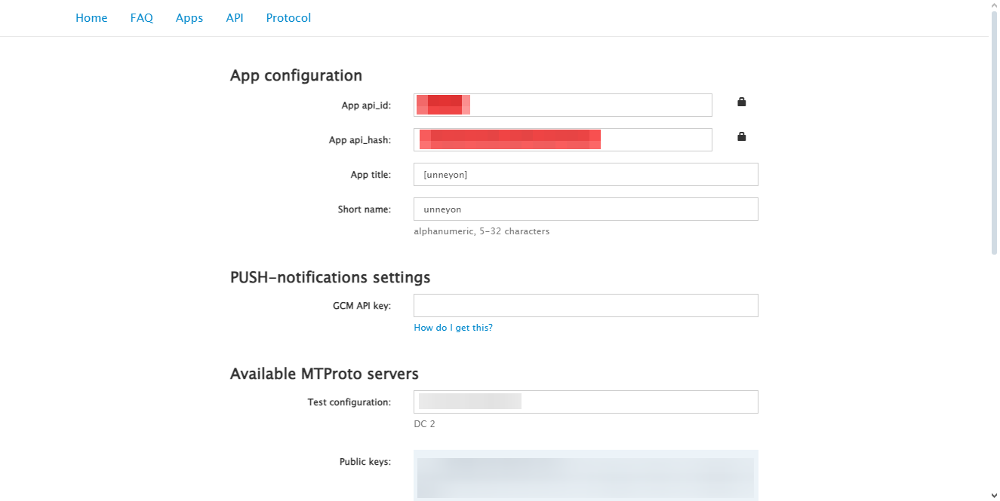

# Hides (spoilers) BOT
## Заполнение конфига
**Конфиг — это файл `config.json`, `example.config.json` создан как пример** 
Используйте в терминале команду `cp example.config.json config.json` (only Linux-like OS) и заполняйте `config.json` в соответствие с Вашими данными.
| Значение | Тип данных | Описание | Пример |
|:-:|:-:|:-:|:-:|
| `token` | **str** | Токен бота | `290371341:AAFRN4gNs1Bx712qdwrSST4C4tgdcjmXg0w` |
| `id` | **int** | Telegram-ID бота | `290371341` |
| `dev_id` | **int** | Ваш Telegram-ID | `36265675` |
| `admin_chat` | **int** | Telegram-ID чата, куда будут отправляться резервные копии конфига и базы данных | `-1004536265675` |
| `app` -> `id` | **int** | `App api_id` [подробнее о его получении](https://github.com/unneyon/hides-bot?tab=readme-ov-file#получение-app-api_id-и-app-api_hash) | `39125171` |
| `app` -> `hash` | **str** | `App api_hash` [подробнее о его получении](https://github.com/unneyon/hides-bot?tab=readme-ov-file#получение-app-api_id-и-app-api_hash) | `176dea581932180dh1dd1485a51` |
> **Остальные поля рекомендуется оставить как есть!**

## Получение `App api_id` и `App api_hash`
#### Переходим на [my.telegram.org](https://my.telegram.org) и авторизовываемся.

#### После авторизации нас встретит такое меню. Нам нужна вкладка [API development tools](https://my.telegram.org/apps).

#### Дальше мы видим создание приложения, если вы тут впервые.
> В данном случае заполнять нужно так: `App name` —  рандомный набор символов `Short name` — короткое и уникальное имя вашего приложения (как ваш @юзернейм) `Platform` — оставьте Android Остальные поля не заполняйте!
##### Остальные поля не заполняйте!

#### Если же Вы тут не впервые, Вас встретит такая картина. Это же у вас будет после создания приложения.

### Вот и нашлись заветные `App api_id` и `App api_hash`!
